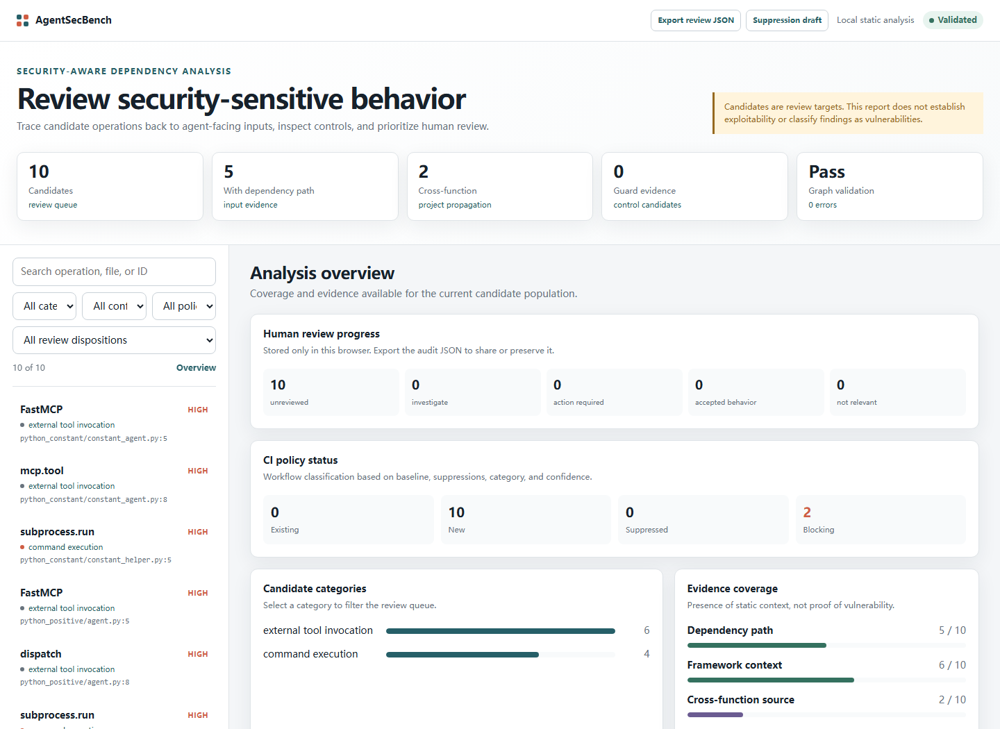

# AgentSecBench

[](https://github.com/A1LinLin1/AgentSecBench/actions/workflows/security-adg-artifacts.yml)


[](LICENSE)

**Find security-sensitive behavior in LLM-agent code and inspect how agent-facing
inputs may reach shells, files, interpreters, browsers, and external tools.**

AgentSecBench is a dependency-free static analyzer for Python and
JavaScript/TypeScript agent repositories. It emits candidate findings,
candidate-centered Security-Aware Agent Dependency Graphs (Security-ADGs),
SARIF, CI policy results, and a self-contained offline review dashboard.

> AgentSecBench discovers review candidates. It does not automatically label
> findings as vulnerabilities or replace impact and boundary validation.



## Try it in two minutes

Requires Python 3.11 or newer. The current preview installs directly from the
repository; no target-project dependencies are installed or executed.

```bash
git clone https://github.com/A1LinLin1/AgentSecBench.git
cd AgentSecBench
python -m pip install --no-deps .
agentsecbench doctor
agentsecbench analyze /path/to/your-agent --output agentsecbench-results
```

Open `agentsecbench-results/report/index.html`. The report works offline and
contains the candidate queue, three graph views, source evidence, dependency
paths, guard context, browser-local review notes, and audit export.

On PowerShell, the analysis command is identical:

```powershell
agentsecbench analyze H:\projects\my-agent `
  --output agentsecbench-results
Start-Process agentsecbench-results\report\index.html
```

## What you get

| Capability | Output |
|---|---|
| Security-sensitive operation discovery | `findings.jsonl` |
| Agent/source-to-effect evidence graphs | `security-adg.jsonl` |
| Visual investigation and local triage | `report/index.html` |
| GitHub and IDE integration | `results.sarif` |
| Existing/new/suppressed CI classification (when enabled) | `policy.json` |
| Concise pull-request summary (when enabled) | `policy-summary.md` |
| Stable automation contract | bundled versioned JSON Schemas |

The analyzer is read-only: it does not import or execute analyzed source,
install target dependencies, or contact external services.

## Use in GitHub Actions

```yaml
name: Agent security review
on: [push, pull_request]

permissions:
  contents: read

jobs:
  agentsecbench:
    runs-on: ubuntu-latest
    steps:
      - uses: actions/checkout@v4
      - name: Analyze agent code
        uses: A1LinLin1/AgentSecBench@v0.1.0
        with:
          path: .
          output: agentsecbench-results
          block-categories: command_execution,filesystem_write,dynamic_code_execution
          minimum-confidence: high
          fail-on-new: "true"
      - name: Upload review report
        if: always()
        uses: actions/upload-artifact@v4
        with:
          name: agentsecbench-results
          path: agentsecbench-results
```

For incremental adoption, create a baseline after reviewing the first scan;
future CI runs can then block only new, unsuppressed candidates.

## How it works

```text
source tree
   │
   ├─ operation + framework detection
   ├─ bounded local/project dependency analysis
   ├─ guard and trust-boundary evidence extraction
   ▼
candidate-centered Security-ADG
   ├─ JSONL + SARIF
   ├─ offline visual review
   └─ baseline/suppression-aware CI policy
```

Python and JavaScript/TypeScript project-level propagation follows direct local
imports and calls with bounded depth and cycle detection. Dynamic dispatch,
reflection, aliases, and inferred trust boundaries remain visibly marked as
analysis limitations instead of being presented as confirmed facts.

## Stable output schemas

Primary outputs carry independent schema versions. List or print the bundled
JSON Schema Draft 2020-12 contracts without network access:

```bash
agentsecbench schema --json
agentsecbench schema finding
agentsecbench schema security-adg
```

See [the compatibility policy](docs/OUTPUT_SCHEMA_COMPATIBILITY.md) for the
versioning rules and complete output-to-schema mapping.

## Research artifact snapshot

The public repository contains the method implementation, deterministic
fixtures, CI checks, paper-facing protocols, and reproducibility scripts. The
current research snapshot is:

| Item | Value |
|---|---:|
| Frozen corpus used by the study | 67 repositories |
| Agent ecosystems | 11 |
| Source files | 37,542 |
| Source size | 291 MB |
| Static candidate pool | 531 candidates |
| Reproduction-confirmed behavior GT | 22 cases |
| Vulnerability GT | 1 case |
| Pending disclosure / upgrade candidate | 1 case |
| Guarded not-vulnerability / negative-control cases | 20 cases |

Important: the full frozen corpus, local analysis outputs, disclosure material,
credentials, raw annotations, and model-panel outputs are intentionally not
included in this public code release.

## What is in this repository

- Static candidate extraction and baseline matching policy.
- Security-ADG construction, framework-adaptive normalization, and local
  dependency/guard evidence extraction.
- Deterministic CI fixtures and unit tests.
- A standalone Security-ADG showcase / figure renderer.
- Reproduction-ground-truth builders and vulnerability-disposition tooling.
- Mutation and microbenchmark evaluation protocols.
- Public method and experiment documentation.

## What is intentionally not included

This repository does not publish:

- private API keys or `.secrets`;
- downloaded third-party repository snapshots under `dataset/repos`;
- private vulnerability-disclosure reports;
- raw participant annotation submissions;
- raw model-panel outputs;
- local runtime artifacts or full analysis outputs.

If you reproduce the full study locally, keep those materials outside public
commits unless they have been explicitly reviewed for release.

## Claim boundaries

Use these boundaries when citing or extending this artifact:

- `531` static candidates are not `531` vulnerabilities.
- Reproduction-confirmed behavior GT is not automatically vulnerability GT.
- Vulnerability GT is not an assigned CVE unless a CNA or maintainer advisory
  assigns one.
- Guarded not-vulnerability cases are not failures; they are negative-control
  and semantic-disambiguation evidence.
- The committed fixtures support deterministic artifact checks, not
  population-level precision/recall/F1 claims.

## Detailed local workflow

Optionally initialize a strict per-project configuration before the first
scan. Direct repository analysis also works without a corpus manifest or
configuration file:

```powershell
agentsecbench init H:\projects\my-agent
agentsecbench analyze H:\projects\my-agent `
  --output agentsecbench-results
```

`init` creates a commented `.agentsecbench.toml` with practical exclusions and
interprocedural analysis enabled. It refuses to overwrite an existing file
unless `--force` is supplied. Use `--json` for editor or automation
integration. The generated configuration is optional: `analyze` also works
immediately with built-in defaults.

This read-only command writes:

- `findings.jsonl`: security-sensitive behavior candidates;
- `security-adg.jsonl`: one candidate-centered Security-ADG per finding;
- `security-adg-summary.json`: dependency, guard, and framework coverage;
- `validation.json`: graph/provenance invariant checks;
- `report/index.html`: a self-contained interactive review dashboard with
  category/evidence overview, responsive candidate filters, CI policy status,
  Security-ADG views, source evidence, dependency paths, browser-local human
  dispositions and notes, review-JSON export, and exact-fingerprint
  suppression-draft export;
- `results.sarif`: SARIF 2.1.0 output for GitHub and compatible IDEs; and
- `summary.json`: the stable run summary.

It does not import or execute target code, install target dependencies, or use
the network. Inferred dependencies, guards, and trust-boundary crossings remain
explicitly marked as static candidates; they are not vulnerability claims.
Existing paper-reproduction scripts remain compatible.

### Adopt in CI without failing on historical findings

After reviewing an initial scan, freeze its stable fingerprints as the project
baseline:

```powershell
agentsecbench baseline agentsecbench-results\findings.jsonl `
  --output .agentsecbench-baseline.json
```

Reference it from `.agentsecbench.toml`:

```toml
[policy]
baseline = ".agentsecbench-baseline.json"
suppressions = ".agentsecbench-suppressions.toml"
blocking_categories = ["command_execution", "filesystem_write", "dynamic_code_execution"]
minimum_confidence = "high"
```

Then make CI fail only when a new, unsuppressed candidate appears:

```powershell
agentsecbench analyze . --output agentsecbench-results --fail-on-new
```

`--fail-on-new` returns exit code `4`. The run writes `policy.json` containing
the existing/new/suppressed classification for every candidate. Stable
fingerprints tolerate line movement when the path, symbol, detector, category,
and evidence text remain unchanged.

Policy filters affect only the CI blocking decision: every candidate remains in
`findings.jsonl`, SARIF, Security-ADG, and the HTML report. The run also writes
`policy-summary.md`, which can be published in GitHub Actions:

```yaml
- name: Analyze changed repository
  run: agentsecbench analyze . --output agentsecbench-results --fail-on-new
- name: Publish AgentSecBench summary
  if: always()
  run: cat agentsecbench-results/policy-summary.md >> "$GITHUB_STEP_SUMMARY"
```

Suppressions are exact-fingerprint records rather than silent broad patterns.
Each record requires an ID, reason, and owner, and may include an expiry date.
Expired suppressions are reported and no longer applied. See
`agentsecbench-suppressions.example.toml` for the auditable format.

The report's human disposition is triage metadata, not vulnerability ground
truth. It is stored under a report-specific key in browser local storage so the
HTML remains offline and no review data is uploaded. Export review JSON before
moving to another browser or machine. Suppression drafts include only findings
explicitly marked `not relevant` and still contain an owner placeholder that
must be reviewed before use.

For Python and JavaScript/TypeScript projects, graph construction also builds a
read-only project call index. Direct local calls and imports are followed
backwards from a sensitive operation to agent-facing entrypoint parameters,
with cycle detection and a bounded depth. Python supports direct local imports
and keyword arguments. JavaScript/TypeScript supports direct named and
namespace ES/CommonJS imports with named functions. Dynamic imports,
reflection, prototype dispatch, and runtime aliases remain explicit analysis
limitations.

### Paired interprocedural ablation

The committed `v4_interprocedural` microbenchmark measures what project-level
propagation adds while holding source files, scan rules, and candidate IDs
fixed. Run the same benchmark once with the stage disabled and once enabled:

```powershell
agentsecbench analyze benchmarks\security_adg_micro\v4_interprocedural `
  --output artifacts\interprocedural-ablation\intraprocedural `
  --no-interprocedural --json

agentsecbench analyze benchmarks\security_adg_micro\v4_interprocedural `
  --output artifacts\interprocedural-ablation\interprocedural --json

python scripts\evaluate_interprocedural_delta.py `
  --baseline-graphs artifacts\interprocedural-ablation\intraprocedural\security-adg.jsonl `
  --interprocedural-graphs artifacts\interprocedural-ablation\interprocedural\security-adg.jsonl `
  --baseline-summary artifacts\interprocedural-ablation\intraprocedural\summary.json `
  --interprocedural-summary artifacts\interprocedural-ablation\interprocedural\summary.json `
  --output-dir artifacts\interprocedural-ablation\comparison
```

The evaluator refuses to compare different candidate populations or changed
candidate coordinates. Its output reports path refinements, framework-source
recovery, language contributions, call depth, and observed runtime. These are
representation-delta measurements, not precision, recall, or vulnerability
ground truth.

### Project configuration and new frameworks

Copy `agentsecbench.example.toml` to `.agentsecbench.toml` in the repository
being analyzed. The `[scan]` table controls path selection and candidate
granularity. Each `[[framework_adapters]]` table can add a new agent framework
using source, decorator, registration, and candidate regexes. Configuration is
strictly validated: unknown keys, invalid regexes, duplicate adapter IDs, and
unsupported languages stop the scan instead of silently reducing coverage.

An explicit configuration can also be selected on the command line:

```powershell
agentsecbench analyze H:\projects\my-agent `
  --config H:\projects\my-agent\.agentsecbench.toml `
  --output agentsecbench-results
```

Run the deterministic CI-equivalent tests:

```powershell
python -m unittest `
  tests.test_security_adg_dataflow `
  tests.test_security_adg_showcase `
  tests.test_heldout_reproduction_case_matrix `
  tests.test_guard_ablation_table `
  tests.test_paper_results_snapshot `
  tests.test_export_paper_tables
```

Build the portable interactive evidence view from the committed fixture:

```powershell
python scripts\generate_security_adg_showcase.py `
  --graphs tests\fixtures\security_adg_showcase.jsonl `
  --output-dir artifacts\security-adg-showcase `
  --max-graphs 2
```

Open:

```text
artifacts/security-adg-showcase/index.html
```

The page lets you compare a sink-only view, a simplified ADG projection, and
the full Security-ADG evidence view for the same candidate.

## Reproducing paper-facing artifacts

The following commands rebuild the public, deterministic paper-facing artifact
pipeline from local evidence files and committed fixtures:

```powershell
python scripts\build_reproduction_ground_truth.py
python scripts\build_vulnerability_gt_upgrade_queue.py
python scripts\build_vulnerability_gt_disposition_matrix.py
python scripts\evaluate_reproduction_gt_coverage.py
python scripts\build_paper_results_snapshot.py
python scripts\export_paper_tables.py
```

Main generated outputs:

```text
analysis/ground_truth/reproduction_confirmed_gt.jsonl
analysis/ground_truth/reproduction_confirmed_gt_summary.json
analysis/ground_truth/vulnerability_gt_upgrade_queue.jsonl
analysis/ground_truth/disposition/vulnerability_gt_disposition_matrix.md
analysis/paper_results/README.md
analysis/paper_results/tables/
```

Depending on your local `.gitignore` policy, these generated outputs may remain
local and untracked.

## Full corpus pipeline

If you have prepared your own frozen corpus manifest, the Security-ADG pipeline
can run static scanning, graph generation, validation, review-queue generation,
and showcase generation:

```powershell
python scripts\run_security_adg_pipeline.py `
  --manifest dataset\corpus_manifest.csv `
  --scope all_corpus `
  --analysis-mode v2_5 `
  --skip-sample-id ASB0024 `
  --output-root artifacts\security_adg\all_corpus_v2_5
```

See [docs/SECURITY_ADG_PIPELINE.md](docs/SECURITY_ADG_PIPELINE.md) for the
artifact layout and CI behavior.

## Method overview

Security-ADG represents each candidate as a typed evidence graph:

```text
G_c = (V, E, A)
```

where `V` contains typed nodes, `E` contains typed evidence edges, and `A`
contains provenance and analysis metadata.

Core node types:

- `agent_or_program_symbol`
- `security_sensitive_operation`
- `external_effect`
- `input_source`
- `trust_boundary`
- `guard_candidate`

Core edge types:

- `contains`
- `may_cause`
- `may_data_depend_on`
- `may_cross`
- `may_guard`

The framework-adaptive normalization layer currently recognizes MCP/FastMCP,
LangChain, CrewAI, AutoGen, OpenAI Agents SDK, Semantic Kernel, and LlamaIndex
tool idioms.

See [docs/METHOD_SECTION_DRAFT.md](docs/METHOD_SECTION_DRAFT.md) and
[docs/PAPER_RQ_EXPERIMENT_MAPPING.md](docs/PAPER_RQ_EXPERIMENT_MAPPING.md) for
the paper-facing method and experiment design.

## Repository layout

```text
.github/workflows/              CI checks and artifact uploads
action.yml                      reusable GitHub Action
src/agentsecbench/              installable analyzer, graph engine, and report UI
src/agentsecbench/schemas/      versioned machine-readable output contracts
annotations/                    UI source and public annotation protocols
baselines/                      predefined baseline rules
benchmarks/security_adg_micro/   microbenchmark cases
docs/                           public method and experiment documentation
experiments/                    method configurations and visualization templates
scripts/                        analysis, graph, GT, baseline, and artifact tooling
tests/                          unit tests and deterministic fixtures
tools/                          toolchain metadata
```

## Useful documents

- [Output schema compatibility](docs/OUTPUT_SCHEMA_COMPATIBILITY.md)
- [docs/BASELINE_MATCHING_POLICY.md](docs/BASELINE_MATCHING_POLICY.md)
- [docs/SECURITY_ADG_PIPELINE.md](docs/SECURITY_ADG_PIPELINE.md)
- [Engineering roadmap](docs/PRODUCT_ROADMAP.md)
- [Contributing](CONTRIBUTING.md)
- [Security policy](SECURITY.md)

## Status

The installable analyzer is an engineering preview (`0.1.0`). Output
schemas are versioned independently, and CI checks cover the CLI, graph
construction, visual report, policy workflow, and bundled schema contracts.
Public claims should follow the claim boundaries above.
